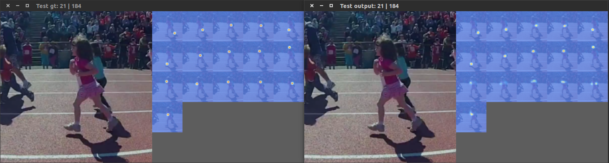

# torch-pose
A Torch based toolkit for 2D single-person human pose estimation in images

## Features

* Multi-thread data loading
* Multi-GPU training
* Logger
* Training/testing results visualization


## Install

1. Install [Torch](http://torch.ch/)

2. Install dependencies
   ```
   luarocks install hdf5
   luarocks install matio
   ```

3. Install nccl for better performance when training with multi-GPUs
   ```
   git clone https://github.com/NVIDIA/nccl.git
   cd nccl
   make 
   make install
   luarocks install nccl
   ```
   set `LD_LIBRARY_PATH` if `libnccl.so` is not found.

4. Prepare dataset
   Create a symbolic link to the images directory of the MPII dataset:
   ```
   ln -s PATH_TO_MPII_IMAGES_DIR data/mpii/images
   ```
   Create a symbolic link to the images directory of the LSP dataset (images are stored in `PATH_TO_LSP_DIR/images`):
   ```
   ln -s PATH_TO_LSP_DIR data/lsp/lsp_dataset
   ```
   Create a symbolic link to the images directory of the LSP extension dataset (images are stored in `PATH_TO_LSPEXT_DIR/images`):
   ```
   ln -s PATH_TO_LSPEXT_DIR data/lsp/lspet_dataset
   ```

## Train and Test

A sample script for training on the MPII dataset with 8-stack hourglass model.

```bash
#!/usr/bin/env sh
expID=mpii/mpii_hg8   # snapshots and log file will save in checkpoints/$expID
dataset=mpii          # mpii | mpii-lsp | lsp | flic
gpuID=0,1             # GPUs visible to program
nGPU=2                # how many GPUs will be used to train the model
batchSize=16          
LR=6.7e-4
netType=hg            # network architecture
nStack=2
nResidual=1
nThreads=4            # how many threads will be used to load data
minusMean=true
nClasses=16
nEpochs=200           
snapshot=10           # save models for every $snapshot

OMP_NUM_THREADS=1 CUDA_VISIBLE_DEVICES=$gpuID th main.lua \
   -dataset $dataset \
   -expID $expID \
   -batchSize $batchSize \
   -nGPU $nGPU \
   -LR $LR \
   -momentum 0.0 \
   -weightDecay 0.0 \
   -netType $netType \
   -nStack $nStack \
   -nResidual $nResidual \
   -nThreads $nThreads \
   -minusMean $minusMean \
   -nClasses $nClasses \
   -nEpochs $nEpochs \
   -snapshot $snapshot \
   # -resume checkpoints/$expID  \ # uncomment this line to resume training
   # -testOnly true \ # uncomment this line to test on validation data
```

* If you want to visualize the training results. Set `-debug true` and use `qlua` instead of `th`.
* use `-loadModel MODEL_PATH` to load a specific model for testing or training

